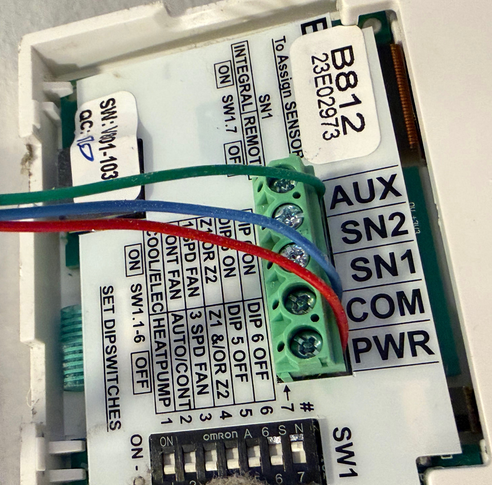

# esphome-actron-b812

ESPHome external component to replace the **Actron B812** wall controller on WSHP (water-source heat pump) air conditioners with a LE85R3-1 relay board.

The B812 communicates over a 2-wire bus using a custom pulse-distance coding protocol that has not (to my knowledge) been documented publicly before. This repo contains both the ESPHome component and [full protocol documentation](docs/protocol.md).

## Features

- **Modes**: off, cool, heat, heat/cool (auto), fan-only
- **Fan speeds**: low, medium, high, auto
- **2-zone damper control**: zone interlocks enforced (at least one zone always active)
- **Soft thermostat** with configurable hysteresis and auto-mode deadband
- **Compressor protection**: minimum off-time before restart (prevents short-cycling)
- **Reversing valve sequencing**: waits for valve to settle before restarting compressor after heat→cool direction change
- **Diagnostic sensors**: compressor state, thermostat direction, protection timers, reversing valve state, and more

## Hardware

The B812 is a wall-mounted controller found on some (seemingly obscure 😆) Actron Controls WSHP units. It connects to the WSHP unit via a 2-wire bus and continuously transmits the desired state at ~222 ms intervals, like an IR remote but over a power wire 😆📺.

### Wiring

The B812 connects to the **LE85R3-1 relay board** inside the WSHP unit via 3 wires:

| Wire | Description |
|---|---|
| **PWR** | Nominally 7 V supply - also the signal wire |
| **COM** | Common / ground return |
| **AUX** | Purpose unclear; possibly a pump interlock. Sits at ~3 V in a standard installation with no observed signalling. The original controller won't call for conditioning without it connected, but this component does not implement it. |



#### Signal encoding

The wall controller transmits by **shorting PWR to COM** for each 150 µs pulse. In other words, the line idles high (~7 V) and pulses are active-low.

#### Power

The original B812 draws ~1 mA idle and ~3 mA with the backlight on. An ESP32 draws significantly more than the ~120 mA the PWR rail can reliably supply, so powering the ESP from PWR directly is not practical.

The recommended approach is to **power the ESP from an external 5 V supply** and use an **N-channel MOSFET** to short PWR to COM under GPIO control:

```
PWR ───────────────────────── drain
                               │
GPIO ── 100 Ω ── gate  (MOSFET)
                  │
                10 kΩ
                  │
COM ──────────────┴──────── source
```

- The **10 kΩ pull-down** from gate to COM ensures the MOSFET stays off if the GPIO is floating (e.g. during boot)
- A **100 Ω series resistor** between the GPIO and gate is recommended to limit inrush current into the gate capacitance; the circuit works without it but it is good practice

The ESPHome side uses `remote_transmitter` with no carrier (DC output):

```yaml
remote_transmitter:
  id: ac_tx
  pin: GPIO5        # adjust to your wiring
  carrier_duty_percent: 100%
```

## Installation

Add to your ESPHome YAML:

```yaml
external_components:
  - source: github://ddoodm/esphome-actron-b812@main
    components: [actron_b812]
```

## Minimal example

```yaml
remote_transmitter:
  id: ac_tx
  pin: GPIO5
  carrier_duty_percent: 100%

climate:
  - platform: actron_b812
    name: "Aircon"
    transmitter_id: ac_tx
```

## Full configuration reference

```yaml
climate:
  - platform: actron_b812
    name: "Aircon"

    # Required
    transmitter_id: ac_tx           # ID of your remote_transmitter

    # Thermostat (optional)
    temperature_sensor_id: my_temp  # Sensor to use for current temperature
    hysteresis: 0.5                 # °C - deadband before engaging in cool/heat mode (default 0.5)
    auto_deadband: 1.0              # °C - gap between heat and cool thresholds in heat/cool mode (default 1.0)
    auto_deadband_timeout: 20min    # How long idle before deadband protection expires (default 20min, 0 to disable)

    # Compressor protection (optional)
    compressor_cooldown: 3min       # Minimum off-time before compressor can restart (default 3min)
    valve_settle_time: 30s          # Time to wait after reversing valve switches before restarting (default 30s)

    # Time source for diagnostic timestamps (optional)
    time_id: ha_time

    # Zone damper switches (optional - both zones on if omitted)
    zone_1:
      name: "Aircon Zone 1"
    zone_2:
      name: "Aircon Zone 2"

    # Diagnostic sensors (all optional)
    compressor_running:
      name: "Aircon Compressor Running"
    state:
      name: "Aircon State"
    thermostat_direction:
      name: "Aircon Thermostat Direction"
    reversing_valve:
      name: "Aircon Reversing Valve"
    call_active:
      name: "Aircon Call Active"
    protection_expires_at:
      name: "Aircon Protection Expires At"
    deadband_active:
      name: "Aircon Deadband Active"
    deadband_expires_at:
      name: "Aircon Deadband Expires At"
```

### Diagnostic sensor values

| Sensor | Type | Values |
|---|---|---|
| `compressor_running` | binary sensor | `true` / `false` |
| `state` | text sensor | `off`, `cooling`, `heating`, `fan_only`, `heat_idle`, `comp_cooldown`, `heat_valve_hold`, `valve_settling` |
| `thermostat_direction` | text sensor | `idle`, `cool`, `heat` |
| `reversing_valve` | binary sensor | `true` = heat position |
| `call_active` | binary sensor | `true` when calling for conditioning |
| `protection_expires_at` | text sensor | ISO 8601 timestamp, or empty when no timer active |
| `deadband_active` | binary sensor | `true` when cross-mode deadband is suppressing engagement |
| `deadband_expires_at` | text sensor | ISO 8601 timestamp, or empty when no deadband active |

## How the thermostat works

The component includes a soft thermostat - connect any ESPHome `sensor` as `temperature_sensor_id` and the component will drive the compressor on/off automatically.

- **Cool / Heat modes**: compressor engages when temperature drifts `hysteresis` past the setpoint; turns off when setpoint is reached
- **Heat/Cool auto mode**: a deadband of `auto_deadband` °C separates the heat and cool engagement thresholds, preventing the system from bouncing between modes after an overshoot. After `auto_deadband_timeout` of idle, the protection expires so the unit can respond to slow thermal drift (e.g. afternoon sun)

If no `temperature_sensor_id` is provided, the component operates as a manual controller - the compressor runs whenever the mode is cool/heat/fan-only and stops when switched off.

## Protocol

See [docs/protocol.md](docs/protocol.md) for the full reverse-engineered protocol documentation, including physical layer, bit encoding, frame format, and observed behaviour.

## Testing

The compressor protection and thermostat logic is covered by a native C++ test suite using [Catch2](https://github.com/catchorg/Catch2). Tests run on the host (no ESP required) using a fake `millis()` clock for deterministic time control.

```sh
cd tests
./run_tests.sh
```

Requires CMake ≥ 3.14 and a C++17 compiler. Catch2 is fetched automatically via CMake FetchContent.

The test suite covers:
- Compressor cooldown on restart
- Heat->cool and cool->heat direction changes with full sequencing
- Reversing valve held during cooldown, settle timer enforced after
- Thermostat hysteresis and HEAT_COOL deadband behaviour
- Rapid mode change and sensor noise stress tests
- Regression tests for production bugs

## Tested on

- ESP32-C3 (esp-idf framework)

## License

MIT
